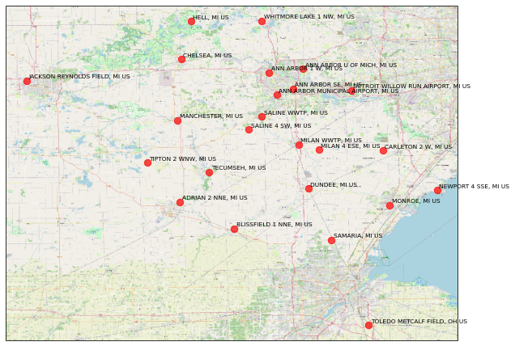
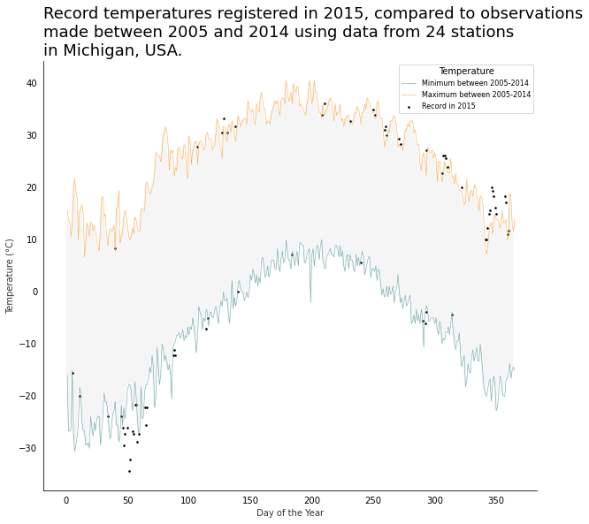

# GCHN Daily Temperatures (2005-2015)

## Description

The objectives and tasks of this notebook is based on an assignment in the [Applied Plotting, Charting & Data Representation in Python Course by University of Michigan on Coursera](https://www.coursera.org/learn/python-plotting?specialization=data-science-python).

The data correspont to 24 stations near **Ann Arbor, Michigan, United States**. The data comes from a subset of The National Centers for Environmental Information (NCEI) [Daily Global Historical Climatology Network](https://www.ncei.noaa.gov/access/search/data-search/daily-summaries)(GHCN-Daily). The GHCN-Daily is comprised of daily climate records from thousands of land surface stations across the globe.

Each row corresponds to a single day of observation for a particular station.

Inside the data files there are many variables, but for this case we only interested in the following:

* **STATION** : station identification code
* **DATE** : date in YYYY-MM-DD format (e.g. 2012-01-24 = January 24, 2012)
* **LATITUDE**: Latitude (decimal degrees)
* **LONGITUDE**: Longitude (decimal degrees)
* **NAME**: Name of the station
* **TMAX** : Maximum temperature (tenths of degrees C)
* **TMIN** : Minimum temperature (tenths of degrees C)

More information about the GHCN-Daily dataset [Here](https://www.ncei.noaa.gov/metadata/geoportal/rest/metadata/item/gov.noaa.ncdc:C00861/html)

Objective:

1. Overlay a scatter of the 2015 data for any points (highs and lows) for which the ten year record (2005-2014) record high or record low was broken in 2015.
2. Watch out for leap days (i.e. February 29th), it is reasonable to remove these points from the dataset for the purpose of this visualization.
3. Make the visual nice!

## Overview of the stations location

## Plot
